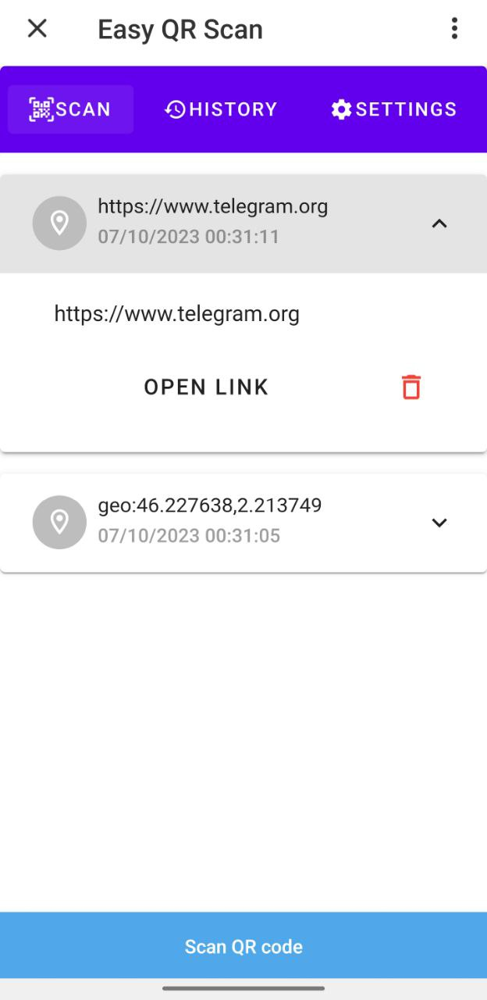
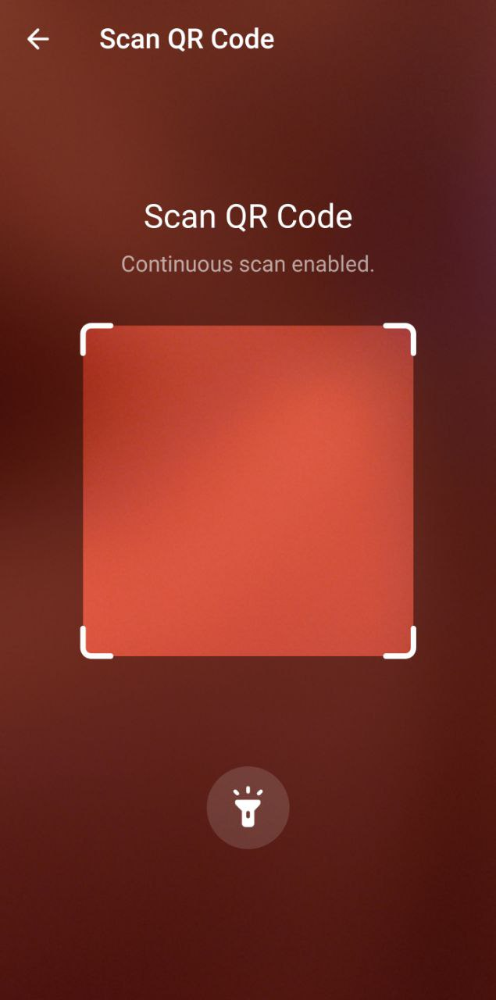
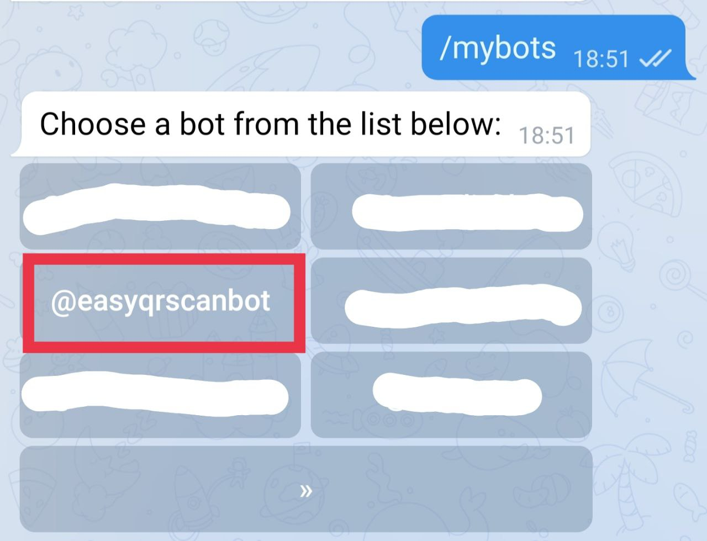
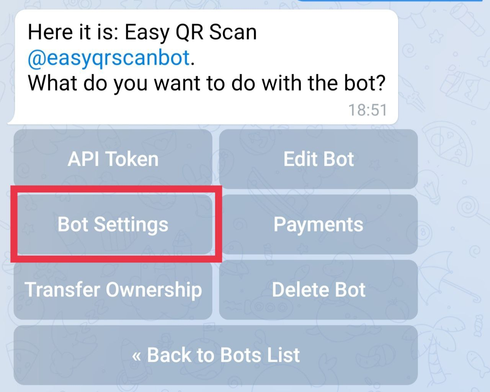
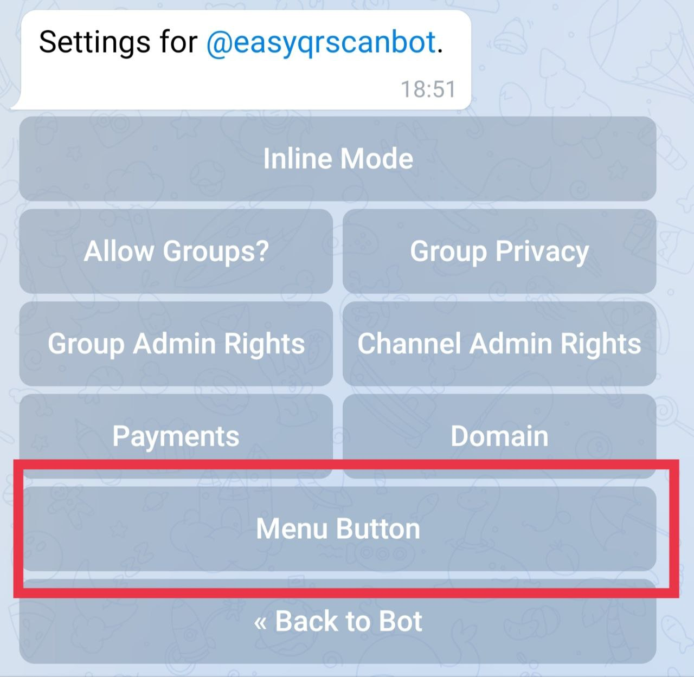
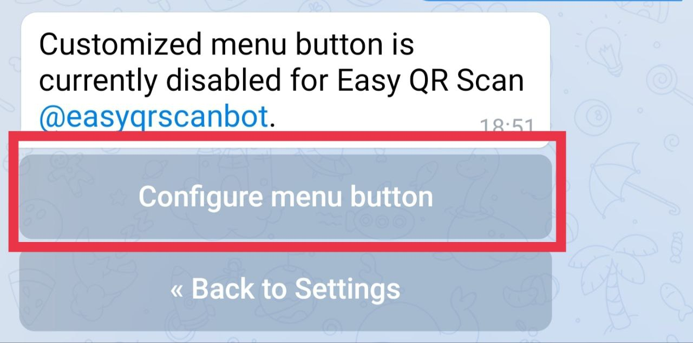
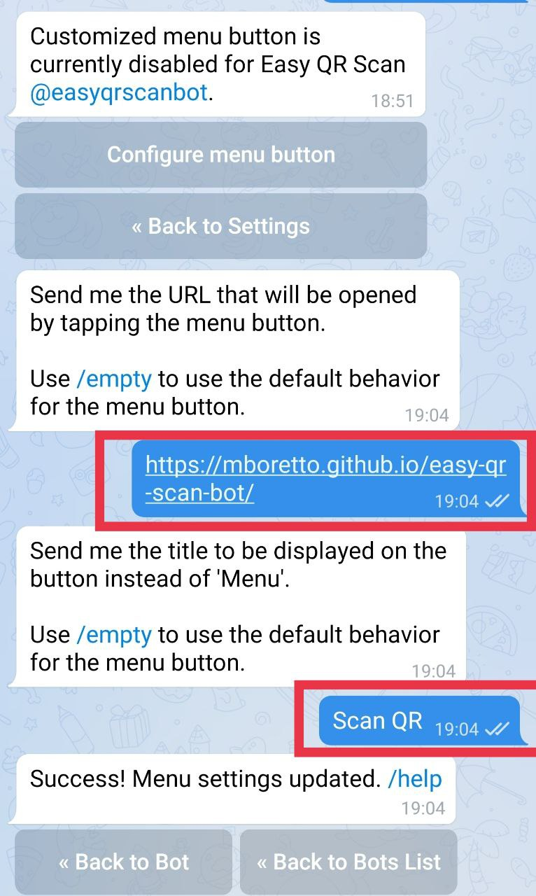

# @easyqrscanbot - Telegram QR Code Scanner - Mini App

Easily scan QR codes using Telegram! 



This repository contains the code of [@easyqrscanbot](https://t.me/easyqrscanbot),
a Telegram [Mini app](https://core.telegram.org/bots/webapps) to scan QR codes.  

## How to Use the QR Code Scanner
Make sure that you have updated your Telegram App, the minimum required version of the Telegram API is `6.9`.

1. Search for `@easyqrscanbot` on Telegram and initiate a private chat.
2. Tap the Menu Button in the bottom left corner (`Scan QR`).


3. Start scanning QR codes!

## Compatibility
The QR code scanner is supported on Telegram smartphone clients (Android and iOS) with Telegram API versions greater than `6.9`. Unfortunately, QR scanning is not available on Telegram Web Clients. However, you can still access the Mini App on the Web Client and review your scan history.


## About the Project
This project serves as an illustration of creating a Telegram Mini App using a modern JavaScript framework like [Vue](https://vuejs.org/). It also demonstrates how to leverage the latest features introduced in Telegram API version 6.9, including:
- QR code scanning
- Utilizing [Telegram Cloud Storage](https://core.telegram.org/bots/webapps#cloudstorage), a key-value database accessible from the Mini App

The project represents a pure Vue Front-End application that uses the [Telegram Cloud Storage](https://core.telegram.org/bots/webapps#cloudstorage) Back-End to store the acquired scans.


## Mini App Deployment
The deployment process is fully automated using GitHub Actions. With every push to the `master` branch, the Mini App is automatically built and deployed to the associated GitHub Pages site.

Access the Mini App here: [Mini App Link](https://mboretto.github.io/easy-qr-scan-bot/).

## For developers
To get started with the project, follow these steps:
1. Clone the repository:
```
git clone https://github.com/MBoretto/easy-qr-scan-bot.git
cd easy-qr-scan-bot
```

2. Install the dependencies:
```
npm install
```
3. Build the project:
```
npm run build
```
To run code linting, use the following command:
```
npm run lint
```
Happy coding!


## Deploy your own Mini App

Before you begin, ensure you have a Telegram Bot. If you don't have one yet, you can create one using [this Telegram guide](https://core.telegram.org/bots/features#botfather).


### Clone and deploy
If you want to deploy your own Mini App, follow these steps:

1. Clone this repository.

2. Enable GitHub Pages for your repository by going to `Settings` -> `Pages` -> Select `GitHub Actions` as the source. GitHub will automatically deploy the Mini App on the GitHub Pages associated with your repository.

You can also choose to deploy your Mini App using any hosting service that supports `https://`.


### Start the Mini App using the Telegram Bot Menu

This is the easiest way to start the Mini App, as it requires you to configure the Telegram Bot Menu only once. Here are the steps to link the Mini App to your bot menu:

1. Open [@BotFather](https://t.me/BotFather) bot and send the command `/mybots`.
2. Select the bot you want to link to the Mini App:

3. Press `Bot Settings`:

4. Press `Menu Button`:

5. Press `Configure menu button`:

6. Insert the URL of your Mini App and specify the name for the Menu button.


Now, you can start your Mini App from the Telegram Bot Menu.


### Start the Mini App using a Telegram Bot command

This method is useful during the development phase, allowing you to specify different URLs for the Mini App without reconfiguring the Telegram Bot Menu. However, it requires a running Telegram bot service. Follow these steps:

1. Install the [python-telegram-bot library](https://python-telegram-bot.org/):
```
pip3 install python-telegram-bot --upgrade
```
2. Rename the `config-example.py` in `config.py`:
```
mv config-example.py config.py
```
3. Edit the `config.py` file and insert your Telegram Bot Token `TOKEN` (you can get it from [@BotFather](https://t.me/BotFather)), `URL`, and `URL_TEST` links.

4. Run the `web-app-launcher.py` script:
```
python3 web-app-launcher.py
```
5. Open your Telegram Bot and send the command `/start` (for the production link) or `/dev` (for the test link) to the bot.
6. Press the button to open a version of the Mini App

Now, you can start and test your Mini App using using the test link.


## Data Model
[Telegram Cloud Storage](https://core.telegram.org/bots/webapps#cloudstorage) is a key-value database accessible from any Telegram client. It allows you to store up to `1024` keys per user per bot, with each value having a limit of `4096` characters. Data is associated with the user's Telegram account and persists across devices. After scanning a QR code, the raw string is stored using the timestamp as key.

The Mini App loads the full scan history on startup and stores it locally. Subsequent scans are stored both in the Telegram Cloud Storage and locally.

The raw data retrieved are manipulated to extract information according to the content of the QR code.
Supported QR code content types:
- URL
- VCard
- Wifi
- Geo
- Text

### Delete your data
In the history tab, expand the QR code you wish to delete and press the `Bin` button. This action removes the QR code from both the Telegram Cloud Storage and local storage. The Mini App does not store any other data, and no cookies are used.

## Continuous Scan
The QR code scanner typically closes after recognizing a code. However, you can enable continuous scan mode by navigating to the settings tab and pressing the `Continuous Scan` button. To disable continuous scan mode, press the button again. You can exit continuous mode by pressing the top-left arrow.

### Haptic Feedback
After successfully scanning a QR code, the device will vibrate to provide feedback.


## Debugging and Troubleshooting 
In the Mini App's settings section, you'll find useful tools for debugging and development:

- `Sync Cloud Storage` button: This syncs the Mini App's local storage with the Telegram Cloud Storage, equivalent to opening and closing the Mini App.
- `Enrich QR codes` button: Triggers computation of raw QR codes for all scans.
- Enabling `Show debug` displays:
    - List of locally cached cloud storage keys
    - List of locally cached cloud storage key-values
    - List of locally enriched cloud storage keys-info


## Components
The project makes use of [Vuetify](https://vuetifyjs.com/), a Vue Components Framework Library.

## Licence
The code is distrubuted under the [MIT License](./LICENSE)